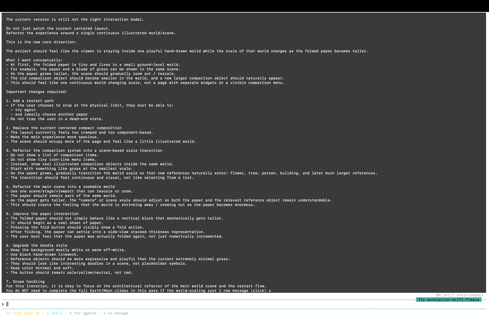
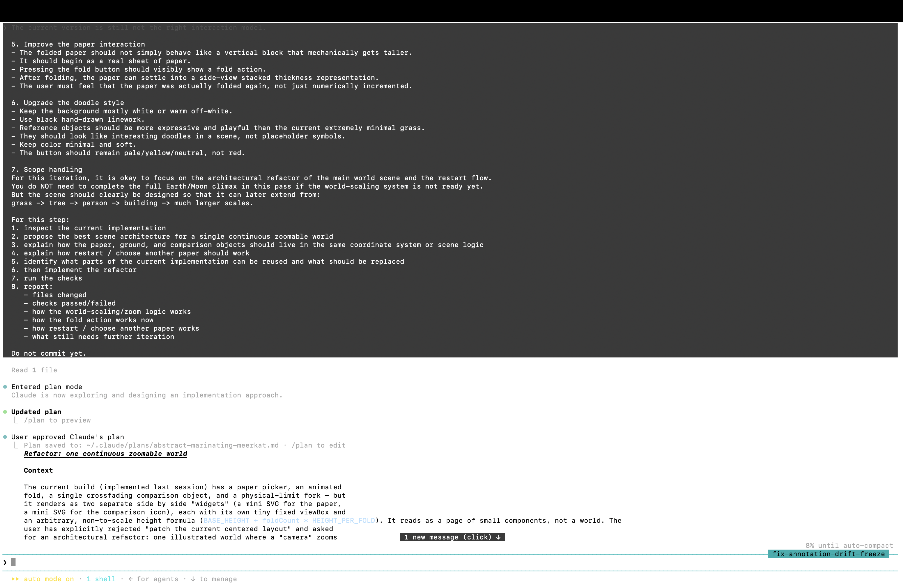
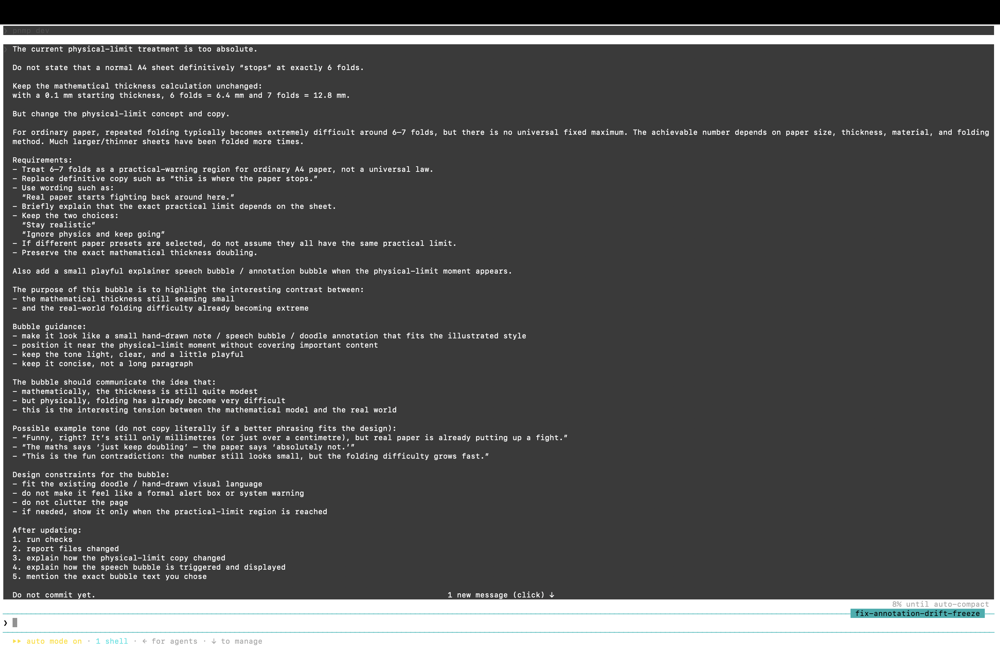
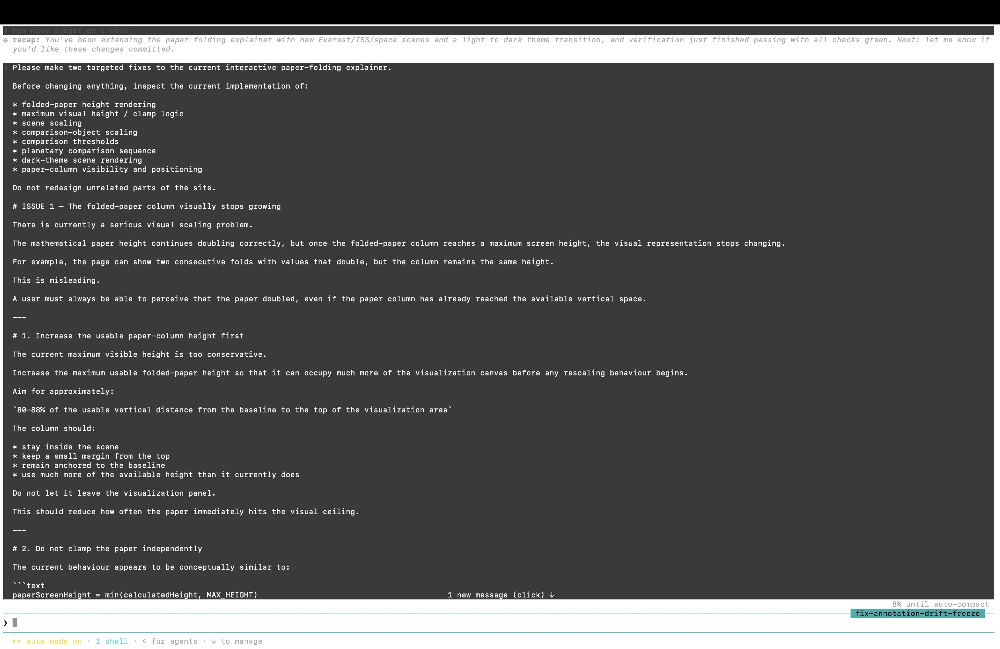
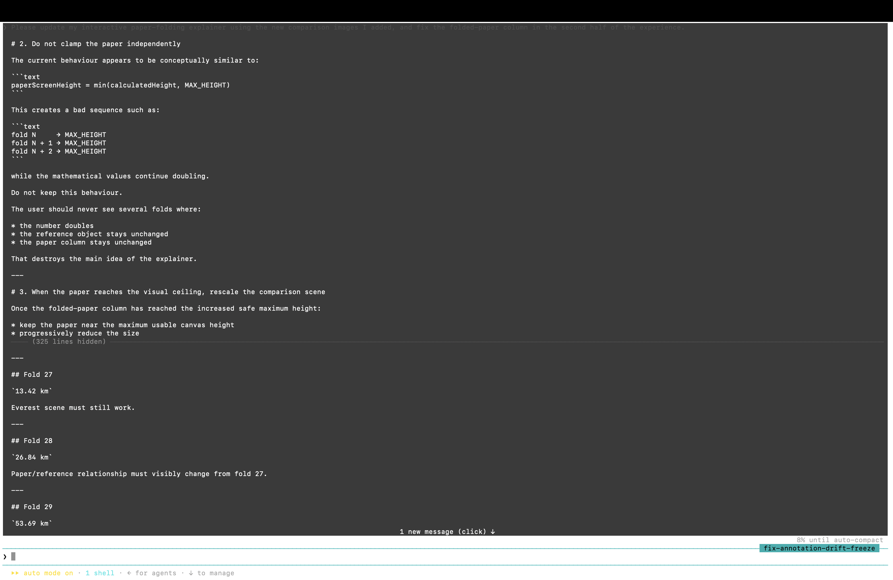
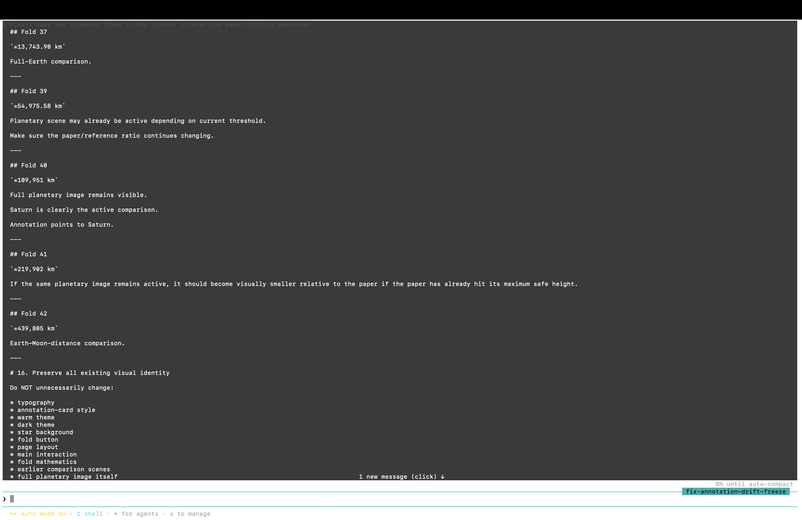
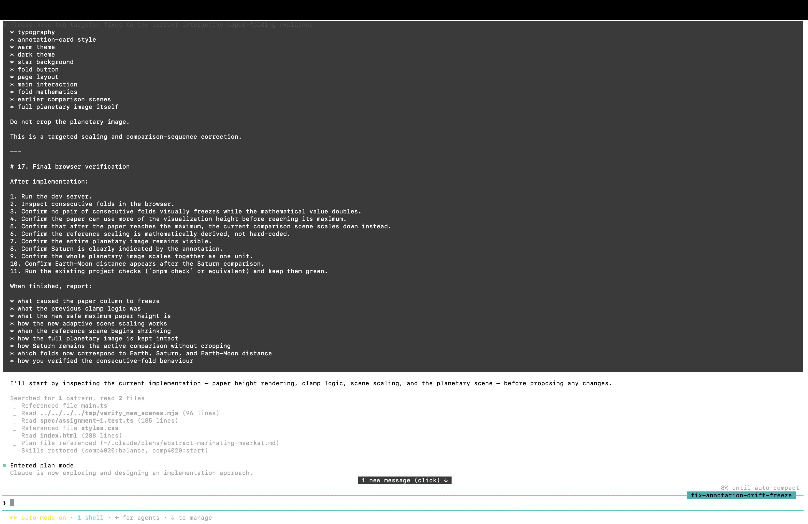
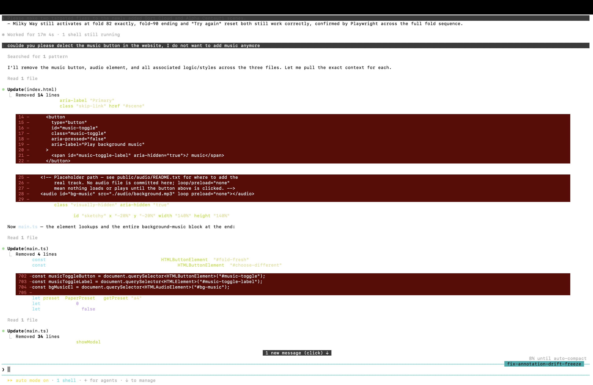

# Process overview

## What I built

I built an interactive explainer about the exponential growth of folded paper. Each fold doubles the paper's thickness, and the site turns that abstract number into a changing visual scale: the paper moves from everyday objects and buildings towards Earth, planetary distances and eventually the Milky Way. The main idea is the contrast between a very simple mathematical rule — keep doubling — and how quickly its consequences become difficult to imagine. The final interaction grew through repeated visual checking and several redesigns rather than from the first generated version.

## The moments that mattered

### 1. Rejecting the dashboard and changing the interaction model

The first working version proved that the fold calculation and comparison logic worked, but it felt like a dashboard: click a button, increase a number, highlight another object. I did not want to polish that structure because the problem was the interaction itself. I stopped implementation and asked Claude to rethink it first:

> The current version is not the right interaction model for this project.
>
> Do not implement changes yet.

I rewrote the direction around a flat sheet that visibly folds and a continuous illustrated world that changes scale with it. The revised `PLAN.md` records what was kept and what had to be replaced. I checked the rendered interaction at desktop and phone sizes before continuing, focusing on whether the paper and comparison objects felt like parts of one scene rather than separate widgets.

Evidence: [`PLAN.md`](./PLAN.md), [`development excerpt 1`](./evidence/claude-development-evidence.md#arc-1--dashboard-style-first-version--interaction--continuous-world-redesign)

### 2. Separating mathematical truth from the physical folding limit

An early version treated six folds as a definite physical stopping point for A4 paper. The mathematics was correct — a 0.1 mm sheet becomes 6.4 mm after six folds and 12.8 mm after seven — but the explanation was too absolute. Instead of changing the doubling model to fit the interface, I kept the exact calculation and changed the claim:

> Do not state that a normal A4 sheet definitively "stops" at exactly 6 folds.

The site now presents 6–7 folds as a practical warning region and explains that real limits depend on paper size, thickness, material and folding method. Different presets therefore do not inherit one universal maximum. The numerical doubling remained unchanged, while the warning was reframed as a contrast between a simple mathematical model and the much messier physical behaviour of real paper.

Evidence: [`development excerpt 2`](./evidence/claude-development-evidence.md#arc-2--physical-folding-limit--gallivan-based-practical-limit-framing)

### 3. Fixing a visual result that contradicted the maths

Later, I noticed consecutive folds could show numbers doubling while the paper column appeared exactly the same height. A successful build was not enough: the rendered page was communicating something false. I asked Claude to inspect the scaling and clamp logic rather than simply make the column taller.

The investigation found that the existing fit calculation eventually collapsed the paper to a constant on-screen height. The scaling model was then changed in stages: the paper first grows normally, the reference scene can shrink when the paper reaches the available height, and at very large scales the camera can pull back further. Later browser verification also exposed an SVG rendering limit that could not have been discovered by looking only at the source code. The corrected behaviour was checked with Playwright at 1920×1080 and 390×844, including consecutive folds in the later scenes.

Evidence: [`development excerpt 3`](./evidence/claude-development-evidence.md#arc-3--visual-scale-stops-changing-even-though-numeric-thickness-keeps-increasing--scaling--camera-redesign)

### 4. Removing a feature that worked

I also asked Claude to add optional background music. The implementation worked: it looped, respected autoplay restrictions and had a theme-aware control. After seeing it as part of the complete explainer, however, I decided it added another system without strengthening the folding idea.

> coulde you please delect the music button in the website, I do not want to add music anymore

I chose deletion rather than continuing to polish it. The audio element, control, styles and state were removed, while unrelated folding and scaling code stayed unchanged. `pnpm check` still passed afterwards. This made the final project more focused and reminded me that finishing a feature was not, by itself, a reason to keep it.

Evidence: [`development excerpt 5`](./evidence/claude-development-evidence.md#arc-5--music-feature-added-then-deliberately-removed)
